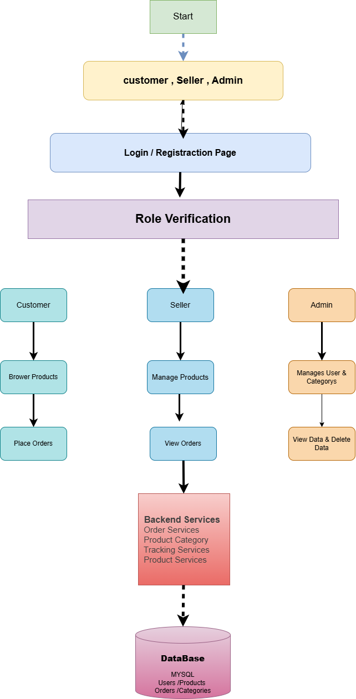

# ShopEase-Team-Project

# ShopEase – Online Product & Order Management System

## Project Overview
ShopEase is a web-based platform designed to manage online products, customers, and orders efficiently.  
It provides a streamlined interface for both administrators and users to manage product listings, track orders, and maintain customer data.

The system helps improve the shopping and order handling process by offering an organized platform for product management, inventory updates, customer interaction, and order tracking.

---

## System Workflow

The following diagram explains the workflow of the ShopEase platform including user roles, authentication, services, and database interaction.
<p align="center">
  
</p>


## Features
- User Registration & Login
- Secure Authentication & Authorization
- Product Catalog Management
- Seller Product Management
- Cart and Order Placement
- Customer Order Tracking
- Seller Order Management
- Admin Dashboard
- Inventory Management
- Secure Authentication

## Project Structure
```
ShopEase-Team-Project/
│── frontend/
│   ├── src/
│   ├── public/
│   └── package.json
│
│── backend/
│   ├── src/main/java/
│   ├── src/main/resources/
│   └── pom.xml
│
│── database/
│   └── schema.sql
│
└── README.md
```
